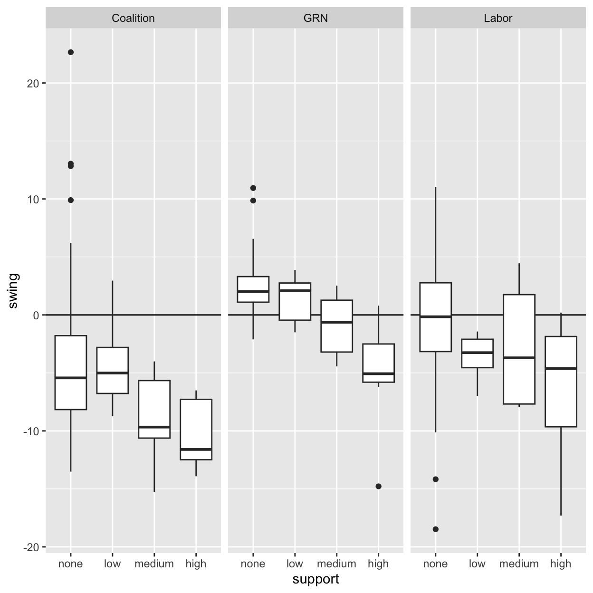

```{=html}
<script src="https://cdn.jsdelivr.net/npm/d3@7"></script>
```
```{=html}
<script src="https://cdn.jsdelivr.net/npm/@observablehq/plot@0.5"></script>
```


::: {.cell}

:::


## C200 supported candidates

C200 supported candidates ran in the following House of Representatives divisions, recording the first preference and two-candidate preferred vote shares indicated in the following table:


::: {.cell}
::: {.cell-output-display}

```{=html}
<div id="htmlwidget-225dbfb41738e556143d" style="width:100%;height:auto;" class="datatables html-widget"></div>
<script type="application/json" data-for="htmlwidget-225dbfb41738e556143d">{"x":{"filter":"none","vertical":false,"extensions":["Buttons","RowGroup"],"data":[["Boothby","Bradfield","Calare","Casey","Clark","Cowper","Curtin","Flinders","Goldstein","Grey","Hughes","Indi","Kooyong","Mackellar","Mayo","North Sydney","Page","Wannon","Warringah","Wentworth"],["DYER, Jo","BOELE, Nicolette","HOOK, Kate","FERRES MILES, Claire","WILKIE, Andrew","HEISE, Caz","CHANEY, Kate","O'CONNOR, Despi","DANIEL, Zoe","HABERMANN, Liz","STEELE, Georgia","HAINES, Helen","RYAN, Monique","SCAMPS, Sophie","SHARKIE, Rebekha","TINK, Kylea Jane","LUKE, Hanabeth","DYSON, Alex","STEGGALL, Zali","SPENDER, Allegra"],["IND","IND","IND","IND","IND","IND","IND","IND","IND","IND","IND","IND","IND","IND","OTH","IND","IND","IND","IND","IND"],[6.54,20.89,20.4,8.34,45.54,26.26,29.46,7.24,34.47,11.26,14.33,40.68,40.29,38.11,31.41,25.2,13.13,19.29,44.82,35.77],[4,2,2,4,1,2,2,4,2,3,3,1,2,2,1,2,3,2,1,2],[null,45.77,40.32,null,70.82,47.68,51.26,null,52.87,null,null,58.94,52.94,52.5,62.26,52.92,null,46.08,60.96,54.19],["1: low C200 support","2: medium C200 support","1: low C200 support","1: low C200 support","1: low C200 support","3: high C200 support","3: high C200 support","1: low C200 support","3: high C200 support","1: low C200 support","2: medium C200 support","1: low C200 support","3: high C200 support","3: high C200 support","2: medium C200 support","3: high C200 support","2: medium C200 support","1: low C200 support","2: medium C200 support","3: high C200 support"],[" "," "," "," ","✅"," ","✅"," ","✅"," "," ","✅","✅","✅","✅","✅"," "," ","✅","✅"]],"container":"<table class=\"display\">\n  <thead>\n    <tr>\n      <th>Division<\/th>\n      <th>Name<\/th>\n      <th>Party<\/th>\n      <th>FP%<\/th>\n      <th>FP rank<\/th>\n      <th>TCP%<\/th>\n      <th>support<\/th>\n      <th>elected<\/th>\n    <\/tr>\n  <\/thead>\n<\/table>","options":{"dom":"Bt","buttons":["copy","csv","excel"],"searching":false,"pageLength":20,"paging":false,"orderFixed":[[6,"desc"],[5,"asc"]],"rowGroup":{"dataSrc":6},"columnDefs":[{"targets":3,"render":"function(data, type, row, meta) {\n    return type !== 'display' ? data : DTWidget.formatRound(data, 1, 3, \",\", \".\", null);\n  }"},{"targets":5,"render":"function(data, type, row, meta) {\n    return type !== 'display' ? data : DTWidget.formatRound(data, 1, 3, \",\", \".\", null);\n  }"},{"targets":4,"render":"function(data, type, row, meta) {\n    return type !== 'display' ? data : DTWidget.formatRound(data, 0, 3, \",\", \".\", null);\n  }"},{"className":"dt-center","targets":[2,7]},{"targets":6,"visible":false},{"className":"dt-right","targets":[3,4,5]}],"order":[],"autoWidth":false,"orderClasses":false,"lengthMenu":[10,20,25,50,100]}},"evals":["options.columnDefs.0.render","options.columnDefs.1.render","options.columnDefs.2.render"],"jsHooks":[]}</script>
```

:::
:::


## Swing by level of C200 support


::: {.cell}
::: {.cell-output-display}
{width=624}
:::
:::

::: {.cell}

:::


### Summary statistics, average swings


::: {.cell}
::: {.cell-output-display}

```{=html}
<div id="htmlwidget-0bbe5ef9b3757bb97e1f" style="width:100%;height:auto;" class="datatables html-widget"></div>
<script type="application/json" data-for="htmlwidget-0bbe5ef9b3757bb97e1f">{"x":{"filter":"none","vertical":false,"extensions":["Buttons","RowGroup"],"caption":"<caption>Average, minimum and maximum swings, by party and level of C200 support for IND candidates<\/caption>","data":[["0: no C200 support","1: low C200 support","2: medium C200 support","3: high C200 support","0: no C200 support","1: low C200 support","2: medium C200 support","3: high C200 support","0: no C200 support","1: low C200 support","2: medium C200 support","3: high C200 support"],["Coalition","Coalition","Coalition","Coalition","GRN","GRN","GRN","GRN","Labor","Labor","Labor","Labor"],[-4.7923152463854,-4.29756807942839,-9.048,-10.2214285714286,2.35916030534351,1.41875,-0.894,-5.09428571428571,-0.357175572519084,-3.66625,-2.624,-6.39142857142857],[-13.51,-8.74,-15.28,-13.91,-2.11,-1.5,-4.44,-14.78,-18.48,-6.99,-7.94,-17.3],["Richmond","Casey","Bradfield","North Sydney","Groom","Calare","Bradfield","Kooyong","Fowler","Calare","Hughes","Goldstein"],[22.65,2.96,-4.01,-6.51,10.94,3.88,2.53,0.8,11.04,-1.43,4.45,0.2],["Mallee","Calare","Page","Kooyong","Griffith","Clark","Mayo","Wentworth","Pearce","Grey","Mayo","Cowper"]],"container":"<table class=\"display\">\n  <thead>\n    <tr>\n      <th>support<\/th>\n      <th>party_group<\/th>\n      <th>Avg<\/th>\n      <th>min<\/th>\n      <th>Div<\/th>\n      <th>max<\/th>\n      <th>Div<\/th>\n    <\/tr>\n  <\/thead>\n<\/table>","options":{"dom":"Bt","buttons":["copy","csv","excel"],"searching":false,"pageLength":12,"paging":false,"orderFixed":[[0,"desc"]],"rowGroup":{"dataSrc":0},"columnDefs":[{"targets":2,"render":"function(data, type, row, meta) {\n    return type !== 'display' ? data : DTWidget.formatRound(data, 1, 3, \",\", \".\", null);\n  }"},{"targets":3,"render":"function(data, type, row, meta) {\n    return type !== 'display' ? data : DTWidget.formatRound(data, 1, 3, \",\", \".\", null);\n  }"},{"targets":5,"render":"function(data, type, row, meta) {\n    return type !== 'display' ? data : DTWidget.formatRound(data, 1, 3, \",\", \".\", null);\n  }"},{"targets":3,"render":"function(data, type, row, meta) {\n    return type !== 'display' ? data : DTWidget.formatRound(data, 0, 3, \",\", \".\", null);\n  }"},{"className":"dt-left","targets":[4,6]},{"targets":0,"visible":false},{"className":"dt-right","targets":[2,3,5]}],"order":[],"autoWidth":false,"orderClasses":false,"lengthMenu":[10,12,25,50,100]}},"evals":["options.columnDefs.0.render","options.columnDefs.1.render","options.columnDefs.2.render","options.columnDefs.3.render"],"jsHooks":[]}</script>
```

:::
:::


### Statistical tests


::: {.cell}
::: {.cell-output-display}
Table: Rate at which swing changes per one point increase in C200 support on four point scale (0-3).

|party_group | estimate| statistic|p.value |
|:-----------|--------:|---------:|:-------|
|Coalition   |     -1.7|      -2.9|<.01    |
|GRN         |     -2.2|      -8.8|<.01    |
|Labor       |     -1.9|      -3.4|<.01    |
:::
:::


## Scatterplot of changes in vote shares


::: {.cell}

:::

::: {.cell}

:::


:::{.cell}

```{.js .cell-code .hidden startFrom="308" source-offset="-0"}
d = transpose(zzz)
//import {Plot} from "@mkfreeman/plot-tooltip"
xdomain = d3.extent(d.flatMap(d => [d.x, d.xend, d.y, d.yend]))
```

:::{.cell-output .cell-output-display}

:::{}

:::{#ojs-cell-1-1 nodetype="declaration"}
:::
:::
:::

:::{.cell-output .cell-output-display}

:::{}

:::{#ojs-cell-1-2 nodetype="declaration"}
:::
:::
:::
:::

:::{.cell}

```{.js .cell-code .hidden startFrom="315" source-offset="0"}
Plot.plot({
  grid: true,
  width: 1000,
  height: 1000,
  inset: 0,
  
  style: {
    fontSize: "14px"
  },
  
  x: {
    label: "Coalition 1st preferences (%) →",
    labelOffset: 36,
    domain: xdomain,
    ticks: [20, 30, 40, 50, 60, 70]
  },
  
  y: {
    label: "↑ ALP & Greens 1st preferences (%)",
    domain: xdomain,
    ticks: [20, 30, 40, 50, 60, 70]
  },
  
  fx: {
    label: null,
    ticks: null
  },
  
  fy: {
    label: null,
    ticks: null
  },

  facet: {
    data: d,
    x: "gx",
    y: "gy",
    label: null,
    width: 400,
    height: 400,
    marginTop: 40,
    marginLeft: 24,
    marginRight: 24,
    marginBottom: 40
    },
  
  marks: [
    Plot.frame({stroke: "#333"}),
    
    Plot.arrow(d,
    {
      x1: "x", 
      x2: "xend",
      y1: "y", 
      y2: "yend",
      bend: false,
      stroke: (d) => d.changing_hands=="TRUE" ? "orange" : "#666",
      title: (d) => `${d.Division} \n 2022 winner: ${d.leading_party} \n 2019 winner: ${d.inc_party}`
    }
    ),
    
    Plot.text(d,
      Plot.selectFirst(
      {
        x: xdomain[1],
        y: xdomain[1],
        dx: -4,
        dy: 8,
        textAnchor: "end",
        text: (d) => "C200 support for IND: " + d.support
      }
      )
    )
  ],
  
  tooltip: {
    fill: "red"
  }  
  
})
```

:::{#fig-swing-vector .cell-output .cell-output-display}

:::{#ojs-cell-2 nodetype="expression"}
:::
Vectors indicate magnitude and direction of swings in House of Representatives elections.  The panels separate divisions by level of C200 support to candidates in the given seat.   Each data point is a House of Representatives division. Orange lines indicate seats changing hands.  Roll over each data point to display division name.
:::
:::


::: {.cell}

:::


## Two-candidate preferred swing for Coalition candidates


::: {.cell}

:::


Two-candidate preferred (TCP) counts for Coalition candidates are available in 143 divisions.  The graph below shows changes in Coalition TCP 2019 to 2022 by level of C200 support for IND candidates in those divisions.   Again, color indicates seats changing hands.


:::{.cell}

```{.js .cell-code .hidden startFrom="495" source-offset="-0"}
zzz3 = transpose(zzz2)
xdomain_all = d3.extent(zzz3.flatMap(d => [d.per, d.per_historic]))

/* viewof theData = Inputs.select(d3.group(zzz3, d => d.support), {label: "C200 level of support:"}) */

/* theData = transpose(zzz2)
    .slice()
    .sort(a => d3.descending(a.per_historic)) */
    
function dotplot(j){
  let theData = zzz3.filter(d => d.support==j)
  let divDomain = theData.map(d => d.Division)
  
  let p = Plot.plot({
    height: theData.length * 15 + 70,
    marginLeft: 90,
    marginTop: 30,
    marginBottom: 40,
    
    y: {
      label: null,
      domain: divDomain, 
      grid: true
    },
    
    x: {
      domain: xdomain_all,
      label: "Coalition TCP (%), 2019 & 2022 →" 
    },
  
  marks: [
  

    Plot.link(divDomain,
    {
      x: 50,
      y1: divDomain.slice(0),
      y2: divDomain.slice(divDomain.length-1)
    }),
    
    Plot.text(theData,
      Plot.selectFirst(
      {
        x: xdomain_all[0],
        y: divDomain.slice(0),
        dx: -70,
        dy: -18,
        fontSize: 14,
        textAnchor: "start",
        text: (g) => "C200 support for IND: " + g.support
      }
      )
    ),
    
    Plot.arrow(theData,
    {
      x1: "per_historic",
      x2: "per",
      y: "Division",
      headLength: 4,
      insetStart: 2,
      stroke: (g) => g.changing_hands=="TRUE" ? "orange" : "#666",
      strokeWidth: 2,
      title: (g) => `${g.Division}\n2022: ${d3.format(".1f")(g.per)}%; Winner: ${g.leading_party} \n 2019: ${d3.format(".1f")(g.per_historic)}%; Winner: ${g.inc_party}`
    }
    ),
    
  Plot.dot(theData,
    {
      x: "per_historic",
      y: "Division",
      r: 2,
      fill: "#666"
    }),
    
  ]
  })
  
  return(p)
}
```

:::{.cell-output .cell-output-display}

:::{}

:::{#ojs-cell-3-1 nodetype="declaration"}
:::
:::
:::

:::{.cell-output .cell-output-display}

:::{}

:::{#ojs-cell-3-2 nodetype="declaration"}
:::
:::
:::

:::{.cell-output .cell-output-display}

:::{}

:::{#ojs-cell-3-3 nodetype="declaration"}
:::
:::
:::
:::

:::{.cell}

```{.js .cell-code .hidden startFrom="578" source-offset="0"}
dotplot("high")
```

:::{.cell-output .cell-output-display}

:::{#ojs-cell-4 nodetype="expression"}
:::
:::
:::

:::{.cell}

```{.js .cell-code .hidden startFrom="582" source-offset="0"}
dotplot("medium")
```

:::{.cell-output .cell-output-display}

:::{#ojs-cell-5 nodetype="expression"}
:::
:::
:::

:::{.cell}

```{.js .cell-code .hidden startFrom="586" source-offset="0"}
dotplot("low")
```

:::{.cell-output .cell-output-display}

:::{#ojs-cell-6 nodetype="expression"}
:::
:::
:::

:::{.cell}

```{.js .cell-code .hidden startFrom="590" source-offset="0"}
dotplot("none")
```

:::{.cell-output .cell-output-display}

:::{#ojs-cell-7 nodetype="expression"}
:::
:::
:::


### Swing data, all divisions, grouped by level of C200 support

<br>


::: {.cell}

:::
